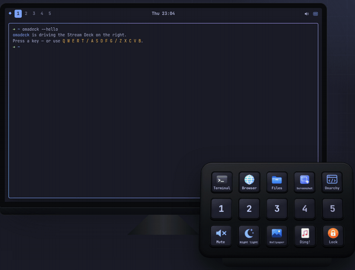

<h1 align="center"><br>omadeck</h1>

<p align="center">
  <b>Elgato Stream Deck support for <a href="https://omarchy.org">Omarchy</a>.</b><br>
  Launch apps, run scripts, play sounds, open websites and drive Hyprland, with your theme on every key.
</p>

<p align="center">
  <a href="https://github.com/thewizster/omadeck/actions/workflows/ci.yml"></a>
  <a href="https://github.com/thewizster/omadeck/releases/latest"></a>
  <a href="https://aur.archlinux.org/packages/omadeck-bin"></a>
  <a href="LICENSE"></a>
</p>

<p align="center">
  <a href="https://omadeck.app/"><b>Website and live demo</b></a> ·
  <a href="#install">Install</a> ·
  <a href="#roadmap">Roadmap</a>
</p>

<p align="center">
  
</p>

Written in Rust: a tiny background daemon drives the hardware, and a GTK4/libadwaita app lays out your keys.

<p align="center">
  
</p>

## Features

- **Five action types**
  - **Launch app:** pick from your installed apps; the app's icon and name come along. Apps launch through `uwsm-app`, the same way Omarchy launches them.
  - **Run script:** optionally in a terminal so you can watch the output.
  - **Play sound:** through PipeWire (`pw-play`), with per-key volume.
  - **Open website:** one click fetches the site's icon for the key. The icon is requested from the site itself; DuckDuckGo's icon service is used only if the site offers none, and the app tells you when that happens.
  - **Hyprland:** any dispatcher. Lua (`hl.dsp.focus({ workspace = "3" })`) is passed straight to `hyprctl dispatch`. Classic syntax (`workspace 3`, `movetoworkspace 2`, `togglefloating`, `fullscreen`, `killactive`, `exec …`) is translated automatically on Hyprland versions that use a Lua config.
- **Icons your way**
  - PNG, JPEG, SVG, WebP or GIF images.
  - App icons from your icon theme.
  - **Nerd Font glyphs**, drawn in your theme's accent colour.
  - Labels are rendered in your Omarchy font.
- **Theme aware.** Key backgrounds, labels, glyphs and the press highlight come from the active Omarchy theme. Run `omarchy theme set …` and the deck re-renders instantly.
- **Live editing.** Changes land on the hardware as you type. Drag keys to rearrange them. Press a physical key to jump to it in the editor.
- **Robust.** Reconnects after unplug/replug, and a typo in a hand-edited config keeps the last good layout on the deck. Uses about 9 MB of RAM and 0% CPU at idle.
- **Portable.** Everything lives in `~/.config/omadeck/`, and imported icons are copied into it, so you can copy that folder to another machine.

<p align="center">
  
</p>

## Install

### AUR (recommended)

```bash
yay -S omadeck-bin          # prebuilt
# or: yay -S omadeck        # build from source
systemctl --user enable --now omadeckd.service
```

The package installs a udev rule, so if the deck isn't detected straight away, replug it once.

### Release tarball (no Rust needed)

Download `omadeck-<version>-x86_64-linux.tar.gz` from the [latest release](https://github.com/thewizster/omadeck/releases/latest), check it against `SHA256SUMS`, then:

```bash
tar xzf omadeck-*-x86_64-linux.tar.gz && cd omadeck-*-x86_64-linux
scripts/install.sh
```

### From source

```bash
# Rust toolchain, if you don't have one yet
mise use -g rust@latest

git clone https://github.com/thewizster/omadeck && cd omadeck
scripts/install.sh
```

The script:

- builds a release binary (pinned to `Cargo.lock`) and installs `omadeck` + `omadeckd` to `~/.local/bin`;
- adds a launcher entry;
- enables the `omadeckd` systemd **user** service, which starts with your graphical session;
- if your user can't already open the deck, shows the udev rule and the exact `sudo` commands, and runs them only if you answer `y`.

To remove omadeck, run `scripts/uninstall.sh`. It leaves your config in place.

### Supported hardware

omadeck speaks to decks through the [`elgato-streamdeck`](https://crates.io/crates/elgato-streamdeck) crate.

| Model | Status |
|-------|--------|
| Stream Deck (V2), 15 keys | ✅ Tested |
| Stream Deck Original / MK.2, 15 keys | Expected to work |
| Stream Deck Mini / Mini MK.2, 6 keys | Expected to work |
| Stream Deck XL / XL V2, 32 keys | Expected to work |
| Stream Deck Neo, 8 keys | Keys expected to work; info screen and touch keys unsupported |
| Stream Deck +, 8 keys | Keys expected to work; dials and touch strip unsupported |
| Stream Deck Pedal | Not supported (no display) |

Got one of the untested models? Please [file a hardware report](https://github.com/thewizster/omadeck/issues/new?template=hardware_report.yml), whether it works or not.

## Use it

Open **omadeck** from the launcher (<kbd>Super</kbd>+<kbd>Space</kbd>). On first run you get a starter layout:

| Row | Keys |
|-----|------|
| 1 | Terminal · Browser · Files · Screenshot · omarchy.org |
| 2 | Workspaces 1–5 (Hyprland) |
| 3 | Mute · Night light · Next wallpaper · a sound · Lock |

Click any key to change it, or clear it with the trash button. The ▶ button tests the action without touching the deck.

### Command line

```text
omadeckd                 run the daemon (normally via systemd)
omadeckd list            show connected decks
omadeckd press 3         run key 3's action (keys count from 0)
omadeckd snapshot x.png  render the current layout to an image
```

`omadeckd press` is handy in Hyprland bindings and scripts, for example to share one action between a key and a keyboard shortcut.

## Configuration

The config file is `~/.config/omadeck/config.toml`. The app edits it for you, but it's plain TOML and safe to edit by hand; the daemon reloads it as soon as you save. See [`examples/config.toml`](examples/config.toml).

```toml
brightness = 70

[style]
follow_theme = true            # colours from the active Omarchy theme

[[key]]
index = 0                      # left-to-right, top-to-bottom, from 0
label = "Terminal"
icon = "icons/utilities-terminal.png"   # relative to ~/.config/omadeck
[key.action]
type = "app"
command = "xdg-terminal-exec"  # or a desktop id like "firefox.desktop"

[[key]]
index = 10
label = "Mute"
glyph = "\U000F075F"           # Nerd Font symbol (or "f075f" / "U+F075F")
[key.action]
type = "app"
command = "omarchy audio output volume mute-toggle"
```

Action types:

| `type` | Fields |
|--------|--------|
| `app` | `command` |
| `script` | `path`, `terminal` |
| `sound` | `file`, `volume` (0.0–1.5) |
| `url` | `url` |
| `hyprland` | `dispatch` |

Per-key look overrides are `background`, `label_color` and `show_label`.

## How it works

```
crates/
  omadeck-core/   config, Omarchy theme, key renderer, actions, IPC types
  omadeckd/       daemon: owns the USB device, paints keys, runs actions
  omadeck-gui/    GTK4 + libadwaita configurator (binary: omadeck)
packaging/        systemd unit, udev rule, desktop entry, AUR PKGBUILDs
scripts/          install / uninstall / package a release
site/             project website: static HTML/CSS/JS with an interactive demo
```

- **Single source of truth.** The GUI only writes `config.toml` (atomically). The daemon watches it, plus Omarchy's theme state in `~/.local/state/omarchy/current`, and repaints.
- **Same pixels everywhere.** The renderer in `omadeck-core` is shared, so the previews in the app are rendered by the same code that paints the hardware.
- **Event feed.** The daemon publishes connect/disconnect and key events as JSON lines on `$XDG_RUNTIME_DIR/omadeck.sock`. The app uses this for its status line and press-to-select.

## Troubleshooting

- **"Service not running"**: `systemctl --user status omadeckd`. Logs: `journalctl --user -u omadeckd -f`.
- **Deck found but can't be opened**: install the udev rule (`packaging/70-omadeck.rules` → `/etc/udev/rules.d/`), then replug the deck.
- **Only one program can own the deck.** Quit the Elgato software or other tools such as `streamdeck-ui` first.

## Roadmap

Ideas, roughly in order. Want one sooner? Open an issue or a PR; see [CONTRIBUTING](CONTRIBUTING.md).

- [ ] **Pages and folders**: more than 15 keys' worth of actions
- [ ] **Toggle keys** with on/off faces (mute, night light, …) that reflect real state
- [ ] **Multi-actions**: run several actions from one key, with optional delays
- [ ] **Stream Deck +**: dials and touch strip (volume, brightness, scrubbing)
- [ ] **OBS** scene and recording keys via obs-websocket
- [ ] **Live keys** that show a clock, CPU usage or the active workspace
- [ ] **Multiple decks** with a layout per serial number
- [ ] **Import/export** of shareable layouts

## How this was built

omadeck was built on Omarchy by Raymond Brady together with Claude Code (Anthropic's AI coding agent), as a showcase of what that pairing can do. Every change goes through the same checks as any contribution: `rustfmt`, `clippy -D warnings`, tests, CI and testing on real hardware.

## License

MIT © Raymond Brady
