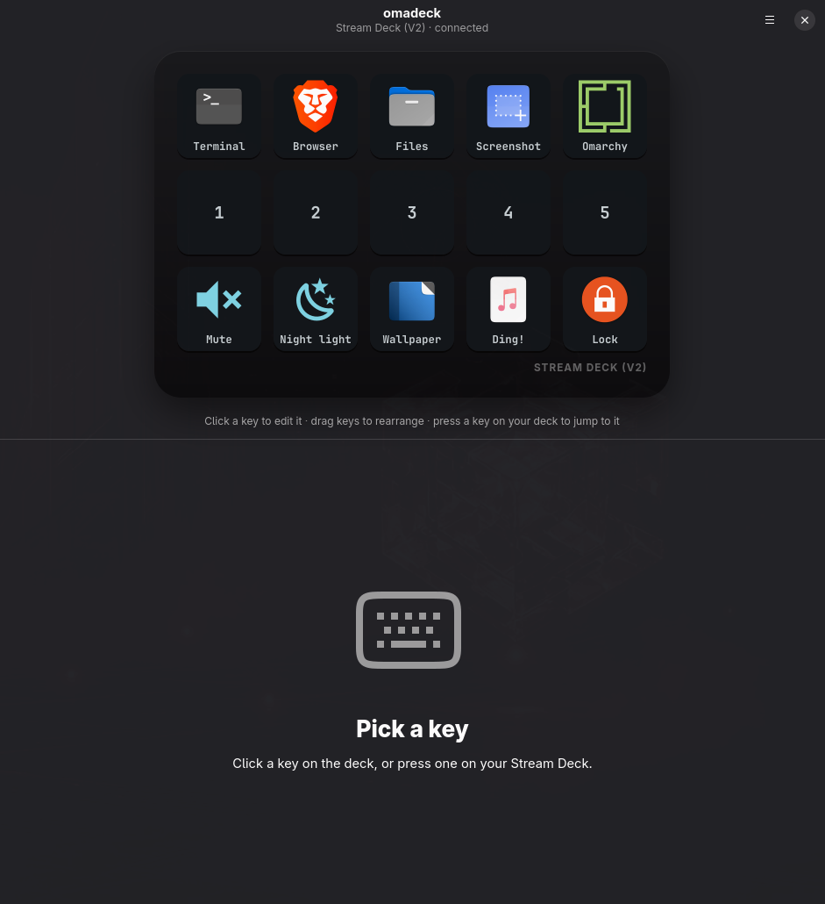
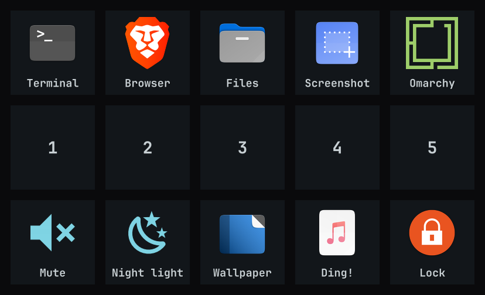

# omadeck

**Elgato Stream Deck support for [Omarchy](https://omarchy.org).** Every key can launch an app, run a script, play a sound, open a website, or fire a Hyprland dispatcher. Each key gets its own icon, and the colours follow your Omarchy theme.

Written in Rust: a tiny background daemon drives the hardware, and a GTK4/libadwaita app lays out your keys.

<p align="center">
  
</p>

## Features

- **Five action types**
  - **Launch app:** pick from your installed apps; the app's icon and name come along. Apps launch through `uwsm-app`, the same way Omarchy launches them.
  - **Run script:** optionally in a terminal so you can watch the output.
  - **Play sound:** through PipeWire (`pw-play`), with per-key volume.
  - **Open website:** one click fetches the site's icon for the key.
  - **Hyprland:** any dispatcher. Lua (`hl.dsp.focus({ workspace = "3" })`) is passed straight to `hyprctl dispatch`. Classic syntax (`workspace 3`, `movetoworkspace 2`, `togglefloating`, `fullscreen`, `killactive`, `exec …`) is translated automatically on Hyprland versions that use a Lua config.
- **Icons your way**
  - PNG, JPEG, SVG, WebP or GIF images.
  - App icons from your icon theme.
  - **Nerd Font glyphs**, drawn in your theme's accent colour.
  - Labels are rendered in your Omarchy font.
- **Theme aware.** Key backgrounds, labels, glyphs and the press highlight come from the active Omarchy theme. Run `omarchy theme set …` and the deck re-renders instantly.
- **Live editing.** Changes land on the hardware as you type. Drag keys to rearrange them. Press a physical key to jump to it in the editor.
- **Robust.** Reconnects after unplug/replug, and a typo in a hand-edited config keeps the last good layout on the deck. Uses about 9 MB of RAM and 0% CPU at idle.
- **Portable.** Everything lives in `~/.config/omadeck/`, and imported icons are copied into it, so you can copy that folder to another machine.
- Works with the Stream Deck Original/V2/MK.2, Mini, XL, Neo and + keys (via the [`elgato-streamdeck`](https://crates.io/crates/elgato-streamdeck) crate).

<p align="center">
  
</p>

## Install

### From source (any Omarchy machine)

```bash
# Rust toolchain, if you don't have one yet
mise use -g rust@latest

git clone https://github.com/rbrady/omadeck && cd omadeck
scripts/install.sh
```

The script:

- builds a release binary and installs `omadeck` + `omadeckd` to `~/.local/bin`;
- adds a launcher entry;
- enables the `omadeckd` systemd **user** service, which starts with your graphical session;
- if your user can't already open the deck, installs a udev rule (asks for sudo).

To remove omadeck, run `scripts/uninstall.sh`. It leaves your config in place.

### Arch package

There's a `PKGBUILD` in [`packaging/arch`](packaging/arch). After installing it, run:

```bash
systemctl --user enable --now omadeckd.service
```

## Use it

Open **omadeck** from the launcher (<kbd>Super</kbd>+<kbd>Space</kbd>). On first run you get a starter layout:

| Row | Keys |
|-----|------|
| 1 | Terminal · Browser · Files · Screenshot · omarchy.org |
| 2 | Workspaces 1–5 (Hyprland) |
| 3 | Mute · Night light · Next wallpaper · a sound · Lock |

Click any key to change it, or clear it with the trash button. The ▶ button tests the action without touching the deck.

### Command line

```text
omadeckd                 run the daemon (normally via systemd)
omadeckd list            show connected decks
omadeckd press 3         run key 3's action (keys count from 0)
omadeckd snapshot x.png  render the current layout to an image
```

`omadeckd press` is handy in Hyprland bindings and scripts, for example to share one action between a key and a keyboard shortcut.

## Configuration

The config file is `~/.config/omadeck/config.toml`. The app edits it for you, but it's plain TOML and safe to edit by hand; the daemon reloads it as soon as you save. See [`examples/config.toml`](examples/config.toml).

```toml
brightness = 70

[style]
follow_theme = true            # colours from the active Omarchy theme

[[key]]
index = 0                      # left-to-right, top-to-bottom, from 0
label = "Terminal"
icon = "icons/utilities-terminal.png"   # relative to ~/.config/omadeck
[key.action]
type = "app"
command = "xdg-terminal-exec"  # or a desktop id like "firefox.desktop"

[[key]]
index = 10
label = "Mute"
glyph = "\U000F075F"           # Nerd Font symbol (or "f075f" / "U+F075F")
[key.action]
type = "app"
command = "omarchy audio output volume mute-toggle"
```

Action types:

| `type` | Fields |
|--------|--------|
| `app` | `command` |
| `script` | `path`, `terminal` |
| `sound` | `file`, `volume` (0.0–1.5) |
| `url` | `url` |
| `hyprland` | `dispatch` |

Per-key look overrides are `background`, `label_color` and `show_label`.

## How it works

```
crates/
  omadeck-core/   config, Omarchy theme, key renderer, actions, IPC types
  omadeckd/       daemon: owns the USB device, paints keys, runs actions
  omadeck-gui/    GTK4 + libadwaita configurator (binary: omadeck)
packaging/        systemd unit, udev rule, desktop entry, PKGBUILD
scripts/          install / uninstall
site/             project website: static HTML/CSS/JS with an interactive demo
```

- **Single source of truth.** The GUI only writes `config.toml` (atomically). The daemon watches it, plus Omarchy's theme state in `~/.local/state/omarchy/current`, and repaints.
- **Same pixels everywhere.** The renderer in `omadeck-core` is shared, so the previews in the app are rendered by the same code that paints the hardware.
- **Event feed.** The daemon publishes connect/disconnect and key events as JSON lines on `$XDG_RUNTIME_DIR/omadeck.sock`. The app uses this for its status line and press-to-select.

## Troubleshooting

- **"Service not running"**: `systemctl --user status omadeckd`. Logs: `journalctl --user -u omadeckd -f`.
- **Deck found but can't be opened**: install the udev rule (`packaging/70-omadeck.rules` → `/etc/udev/rules.d/`), then replug the deck.
- **Only one program can own the deck.** Quit the Elgato software or other tools such as `streamdeck-ui` first.

## License

MIT. Built on Omarchy by Raymond Brady with Claude.
